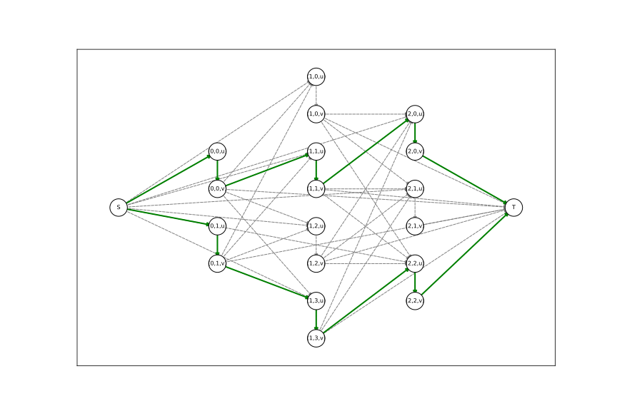
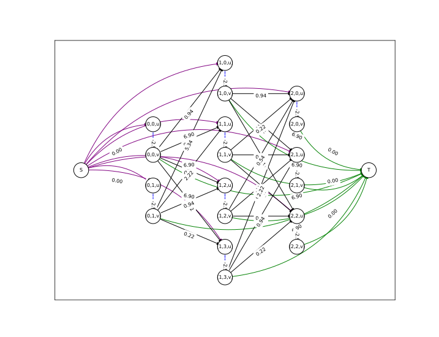
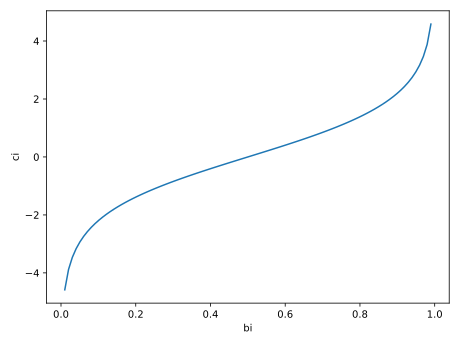
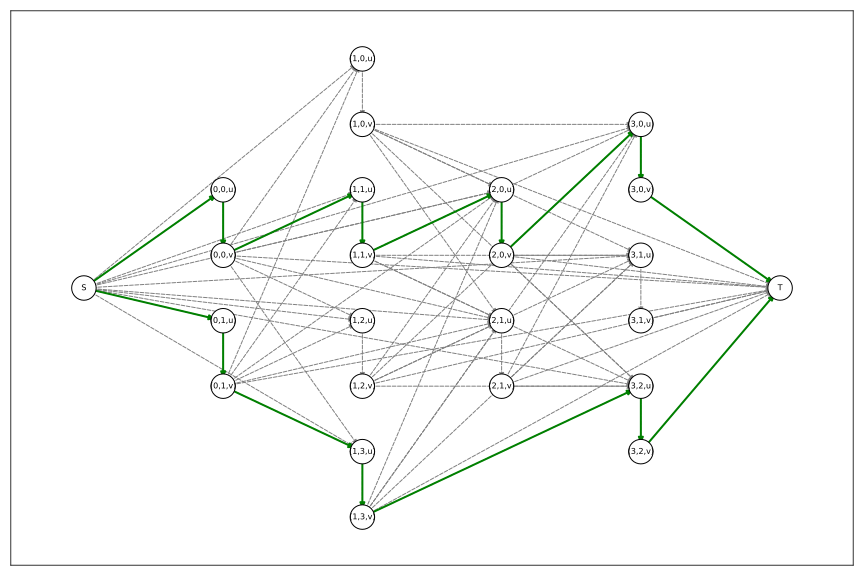
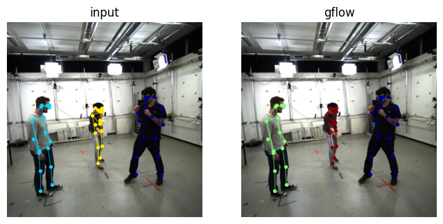
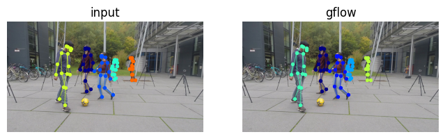
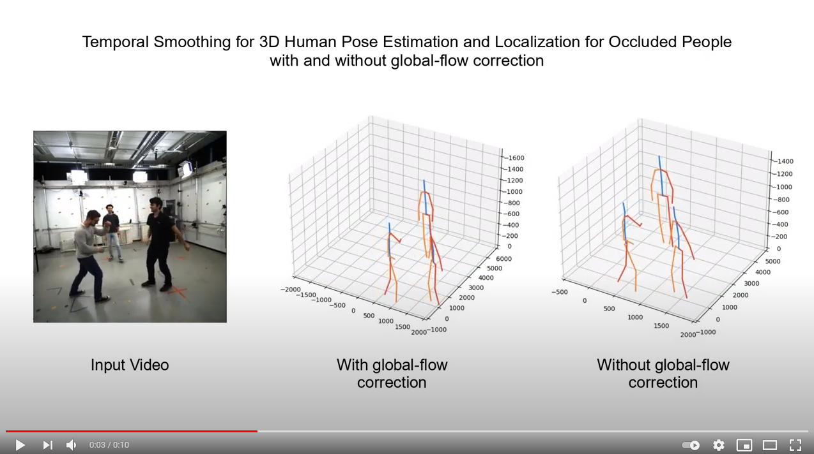

# **py-globalflow**
Python implementation of _Global Data Association for MOT Tracking using Network Flows_ (zhang2008global) with minor tweaks and applications to human pose tracking.

Features
- **Problem agnostic**: No restrictions are set on the type of observations. Related probabilities are computed from callable functions that return log-probabilities of specific events.
- **Occlusions**: Short term occlusions can be handled by enabling short-cut connections between flow nodes (see remarks below).
- **Plotting**: Helpers for plotting the flow graph and any solution.

## Example
```python
import matplotlib.pyplot as plt
import numpy as np
import scipy.stats

import globalflow as gflow

timeseries = [
    [0.0, 1.0],  # obs. at t=0
    [-0.5, 0.1, 0.5, 1.1],  # obs. at t=1
    [0.2, 0.6, 1.2],  # obs. at t=2
]

# Define the class that provides costs. Here we inherit 
# flow.StandardGraphCosts which already predefines some costs
# based on equations found in the paper.
class GraphCosts(gflow.StandardGraphCosts):
    def __init__(self) -> None:
        super().__init__(
            penter=1e-3, pexit=1e-3, beta=0.05, max_obs_time=len(timeseries) - 1
        )

    def transition_cost(self, x: gflow.FlowNode, y: gflow.FlowNode) -> float:
        tdiff = y.time_index - x.time_index
        logprob = scipy.stats.norm.logpdf(
            y.obs, loc=x.obs + 0.1 * tdiff, scale=0.5
        ) + np.log(0.1)
        return -logprob

# Setup the graph
flow = gflow.GlobalFlowMOT(
    obs=timeseries,
    costs=GraphCosts(),
)

# Solve the problem
flowdict, ll, num_traj = flow.solve()
print(
    "optimum: log-likelihood", ll, "number of trajectories", num_traj
)  # optimum: log-likelihood 6.72 number of trajectories 2

# Note, while the flowdict structure is the most general representation
# for the solution of the problem, it might be hard to work with in
# practice. See gflow.find_trajectories and gflow.label_observations
# to convert between representations.

# Plot the graph and the result.
plt.figure(figsize=(12, 8))
gflow.draw.draw_graph(flow)
plt.figure(figsize=(12, 8))
gflow.draw.draw_flowdict(flow, flowdict)
plt.show()
```

The following graph shows the optimal trajectories

<div align="center">

</div>

and problem setup

<div align="center">

</div>

## Install
```bash
pip install git+https://github.com/cheind/py-globalflow
```

## Remarks

The paper (zhang2008global) considers the problem of finding the global optimal trajectories _T_ from a given set of observerations _X_. Optimality is defined in terms maximizing the posterior probability p(_T_|_X_). Given some independence assumptions (section 3.1) the paper decomposes the distribution into two main factors: a) the likelihoods of observations p(xi|_T_) and b) the probability of a single trajectory Ti p(Ti):
- p(xi|_T_) ~ Bernoulli(1-beta)
- p(Ti) ~ Markov chain consisting of appearance, linking and disappearing probabilities between involved observations

Given probabilistic formulation, the task of finding optimal trajectories can be mapped to a min-cost-flow problem. The interpretation of this mapping is quite intuitive
> Each flow path can be interpreted as an object trajectory, the amount of the flow
sent from s to t is equal to the number of object trajectories, and the total cost of the flow on G corresponds to the loglikelihood of the association hypothesis (zhang2008global).

### Observation probabilities p(xi|_T_)

p(xi|_T_) is modeled as a Bernoulli variable with parameter (1-b), where b(eta) is probability of being a false-positive. The derived cost term (eq. 11) Ci = log(b/(1-b)), is derived as follows ()
```
log p(xi|_T)        = log((1-bi)^fi*bi^(1-fi))
                    = fi*log(1-bi) + (1-fi)*log(bi)
                    = fi*log(1-bi) - fi*log(bi) + log(bi)
-log p(xi|_T)       = -fi*log(1-bi) + fi*log(bi) - log(bi)
                    = fi*log(bi/(1-bi)) - log(bi)
amin -log p(xi|_T)  = amin fi*log(bi/(1-bi))
                    = amin fi*ci
```
with fi being the indicator variable of whether xi is part of the solution or not. The term -log(bi) vanishes as it can be regarded constant wrt to argmin. The plot below graphs bi vs ci.

<div align="center">

</div>

As the probability of false-positive drops below 0.5, the auxiliary edge cost between ui/vi edge cost gets negative. This allows the optimization to introduce new trajectories that increase the total flow likelihood. All other costs (pairing, appearance, disappearance) are negative log probabilities and hence positive.

## Short-term occlusions
In the original formulation a short-term occlusion causes a track to end. This library adds support for short-term occlusions via a simple idea: skip-connections. Skip-connections allow observations at time `t` to pair previous observations up to `t-1-l`, where `l` is the number of skip layers (defaults to zero).

Given a similar set of observations as above
```python
timeseries = [
    [0.0, 1.0],  # obs. at t=0
    [-0.5, 0.1, 0.5, 1.1],  # obs. at t=1
    [0.2, 0.6],  # obs. at t=2
    [0.3, 0.6, 1.3],  # obs. at t=3
]
```

we see that a potential track `(1.0, 1.1, -, 1.3)` is occluded at time 2. Setting skip-layers `l=1` we get the following solution that successfully connects this track.

<div align="center">

</div>

Note, that the transition probability p(xi|xj) will need to incorporate the time-difference (i.e via a motion model that is application dependent). See `examples/minimal_occlusions.py` for full details.

## 2D Human Pose Tracking
This repository contains an example to use **py-globalflow** for tracking 2D human pose outputs. The application performs tracking purely on geometric joint properties and hence only 2D pose results are required. See

```
python -m examples.track_poses --help 
```

### 2D Pose Results

Below are two renderings that compare input to found trajectories without short-cut layers. The pose 2D human pose prediction is done by (metha2018single, wang2020deep) on samples from the MuPoTS-3D (mehta2018single) and MPI-INF-3DHP (mono-3dhp2017).

<div align="center">
    <a href="https://www.youtube.com/watch?v=bO0R1tq_wcI"></a>
</div>

<div align="center">
    <a href="https://www.youtube.com/watch?v=wY8X0AO-MTo"></a>
</div>

### 3D Pose Results

The following video shows the beneficial effect of **py-globalflow** on 3D human pose estimation. This is based on the work of (veges2020temporal) that notes the following drawback of their method:
> Also, one drawback of our approach is that it does not include tracking, the combination with a tracking algorithm
remains future work.

When applied to multi-person scenarios and  the person IDs get mixed up, the algorithm tends towards their middle poses. That is, the person on one side is attracted to the other side and vice versa. This leads to hallucinations that look like artificial dances of the persons. 

[](https://www.youtube.com/watch?v=aU3whnxvXFc)

## References
```bibtex
@inproceedings{zhang2008global,
  title={Global data association for multi-object tracking using network flows},
  author={Zhang, Li and Li, Yuan and Nevatia, Ramakant},
  booktitle={2008 IEEE Conference on Computer Vision and Pattern Recognition},
  pages={1--8},
  year={2008},
  organization={IEEE}
}

@inproceedings{mehta2018single,
  title={Single-shot multi-person 3d pose estimation from monocular rgb},
  author={Mehta, Dushyant and Sotnychenko, Oleksandr and Mueller, Franziska and Xu, Weipeng and Sridhar, Srinath and Pons-Moll, Gerard and Theobalt, Christian},
  booktitle={2018 International Conference on 3D Vision (3DV)},
  pages={120--130},
  year={2018},
  organization={IEEE}
}

@article{wang2020deep,
  title={Deep high-resolution representation learning for visual recognition},
  author={Wang, Jingdong and Sun, Ke and Cheng, Tianheng and Jiang, Borui and Deng, Chaorui and Zhao, Yang and Liu, Dong and Mu, Yadong and Tan, Mingkui and Wang, Xinggang and others},
  journal={IEEE transactions on pattern analysis and machine intelligence},
  year={2020},
  publisher={IEEE}
}
@inproceedings{mono-3dhp2017,
 author = {Mehta, Dushyant and Rhodin, Helge and Casas, Dan and Fua, Pascal and Sotnychenko, Oleksandr and Xu, Weipeng and Theobalt, Christian},
 title = {Monocular 3D Human Pose Estimation In The Wild Using Improved CNN Supervision},
 booktitle = {3D Vision (3DV), 2017 Fifth International Conference on},
 url = {http://gvv.mpi-inf.mpg.de/3dhp_dataset},
 year = {2017},
 organization={IEEE},
 doi={10.1109/3dv.2017.00064},
} 

@InProceedings{veges2020temporal,
  author="V{\'e}ges, M. and L{\H{o}}rincz, A.",
  title="Temporal Smoothing for 3D Human Pose Estimation and Localization for Occluded  People",
  booktitle="Neural Information Processing",
  year="2020",
  pages="557--568",
}
```
